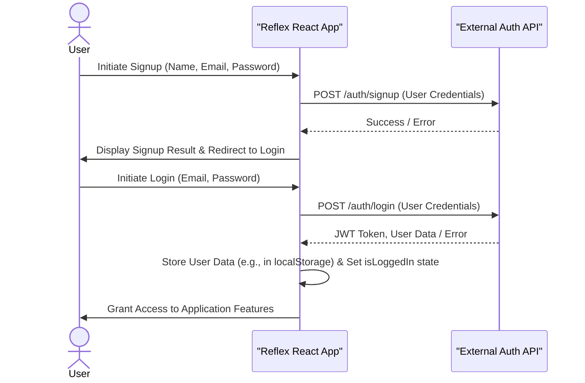
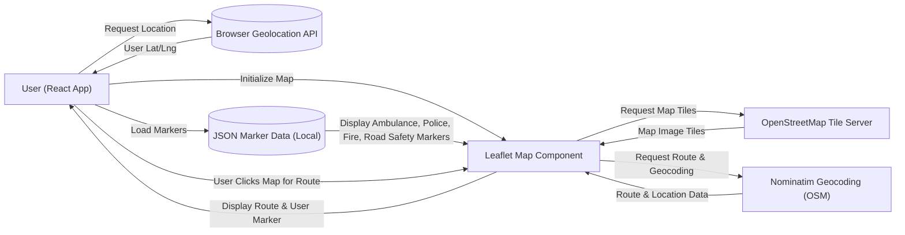
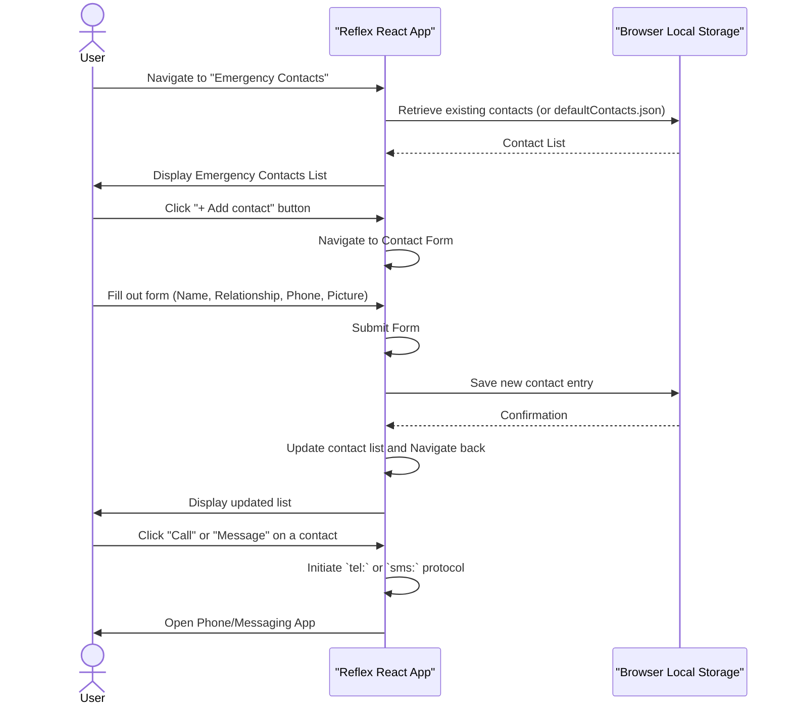
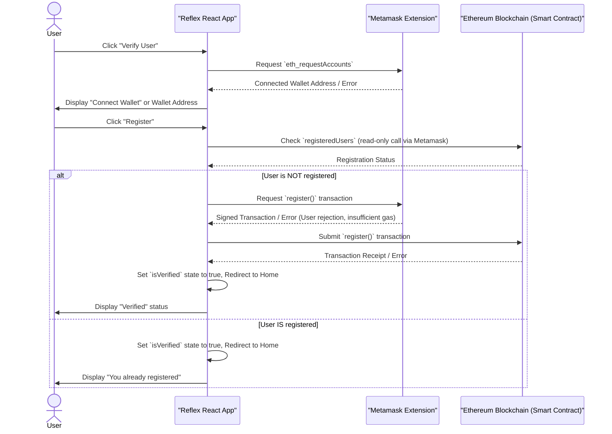
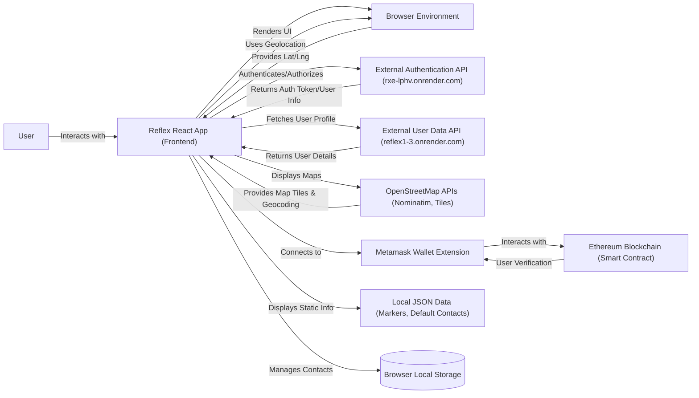

# Reflex: Your Essential Emergency Companion

Reflex is an intuitive web application designed to be your reliable partner during emergencies. It helps you quickly locate critical emergency services nearby, securely store your important contacts, and provides practical, step-by-step advice for a wide range of urgent situations. It's built for immediate, straightforward support when you need it most.

## Installation

To get Reflex up and running on your local machine, follow these steps:

1.  **Clone the Repository**:

    ```bash
    git clone https://github.com/EbubeStrong/reflex-app.git
    cd reflex-app
    ```

2.  **Install Dependencies**:
    Navigate to the project directory and install the necessary packages using npm or yarn.

    ```bash
    npm install
    # or
    yarn install
    ```

3.  **Start the Development Server**:
    Launch the application in development mode.

    ```bash
    npm start
    # or
    yarn start
    ```
    This will open the application in your browser, typically at `http://localhost:3000`.

## Usage

Reflex makes it easy to find help and information when you need it most.

1.  **Explore Emergency Services**: Use the interactive maps to find the nearest hospitals, police stations, fire services, and road safety points. The app automatically detects your location to show relevant services close by.
2.  **Access Quick Tips & Resources**: Navigate to the "Information Resources" section for practical guides on First Aid, Fire Safety, Road Safety, Domestic Violence, and Substance Abuse.
3.  **Manage Emergency Contacts**: Store your crucial contacts in the "Emergency Contacts" section for quick calling or messaging in critical situations.
4.  **Verify Your Account**: Connect your Metamask wallet to verify your identity, providing an extra layer of trust and security.

### Navigating Emergency Maps
On the homepage or the "Realtime tracking" page, you can:
*   View all service providers on a single map or filter by specific types like "Ambulance," "Police," "Fire Service," or "Road Safety."
*   Click on a marker to see the service provider's name and contact information.
*   The map automatically routes you from your current location to a selected destination if you click on the map, providing turn-by-turn directions.

### Managing Your Profile
Once logged in, you can update your account preferences, including your name and location, via the "Account preferences" section found in the settings.

## Features

Reflex comes packed with features designed to keep you safe and informed:

*   **User Authentication & Profile Management**: Secure signup, login, password reset, and personal profile updates (name, location).
*   **Real-time Emergency Service Location**: Interactive maps displaying nearby hospitals, police stations, fire services, and road safety points based on your current location.
*   **Personalized Emergency Contacts**: Add, view, and quickly call or message pre-saved emergency contacts.
*   **Web3 User Verification**: Connect your Metamask wallet to register and verify your identity on the blockchain, enhancing trust.
*   **Comprehensive Information Resources**: Detailed guides and quick tips on First Aid, Fire Safety, Road & Driver Safety, Domestic Violence, and Substance Abuse.
*   **Progressive Web App (PWA)**: Offline capabilities and installability for a reliable experience even without internet access.

### Feature Workflow: User Authentication
Users can sign up, log in, reset passwords, and manage their personal profiles, including name and location. The application interacts with an external backend API for these operations.



### Feature Workflow: Real-time Emergency Service Location
The app displays various emergency service providers on an interactive map, using the user's current geolocation.



### Feature Workflow: Personalized Emergency Contacts
Users can add, view, and initiate calls or messages to their emergency contacts directly within the app.



### Feature Workflow: Web3 User Verification
Users can connect their Metamask wallet and register on a smart contract to verify their identity within the application.



## System Architecture / Design

Reflex is built as a client-side React application. It uses browser-native capabilities for geolocation and local storage, interacts with external APIs for authentication and reverse geocoding, and integrates with the Ethereum blockchain via Metamask for user verification.



## Technologies Used

| Technology             | Description                                   |
| :--------------------- | :-------------------------------------------- |
| **React**              | Frontend JavaScript library for UI development. |
| **TailwindCSS**        | Utility-first CSS framework for styling.      |
| **React Router DOM**   | Declarative routing for React applications.   |
| **Leaflet**            | Open-source JavaScript library for interactive maps. |
| **React-Leaflet**      | React components for Leaflet maps.            |
| **Leaflet-Routing-Machine** | Adds routing capabilities to Leaflet maps.  |
| **Leaflet-Control-Geocoder** | Geocoding search control for Leaflet maps. |
| **Axios**              | Promise-based HTTP client for API requests.   |
| **Ethers.js**          | JavaScript library for interacting with the Ethereum blockchain. |
| **React-Slick**        | Carousel component for React.                 |
| **Workbox**            | Tools for building Progressive Web Apps (PWAs). |

## External API Interactions

Reflex, being a frontend application, interacts with several external APIs for its core functionality:

#### `POST https://rxe-lphv.onrender.com/auth/signup`
**Description**: Registers a new user with the backend authentication service.

**Request**:
```json
{
  "name": "John Doe",
  "email": "john.doe@example.com",
  "password": "StrongPassword123"
}
```

**Response**:
```json
{
  "status": "success",
  "data": {
    "user": {
      "id": "user_id_string",
      "name": "John Doe",
      "email": "john.doe@example.com"
    }
  }
}
```

**Errors**:
- 400: User already exists with this email.
- 500: Server error.

#### `POST https://rxe-lphv.onrender.com/auth/login`
**Description**: Authenticates a user and provides a JWT for subsequent authenticated requests.

**Request**:
```json
{
  "email": "john.doe@example.com",
  "password": "StrongPassword123"
}
```

**Response**:
```json
{
  "status": "success",
  "token": "eyJhbGciOiJIUzI1Ni...",
  "data": {
    "user": {
      "id": "user_id_string",
      "name": "John Doe",
      "email": "john.doe@example.com"
    }
  }
}
```

**Errors**:
- 401: Invalid credentials.
- 500: Server error.

#### `POST https://rxe-lphv.onrender.com/auth/forgotpassword`
**Description**: Sends a password reset link to the user's registered email address.

**Request**:
```json
{
  "email": "john.doe@example.com"
}
```

**Response**:
```json
{
  "status": "success",
  "message": "Password reset email sent."
}
```

**Errors**:
- 404: User with this email not found.
- 500: Server error.

#### `POST https://rxe-lphv.onrender.com/auth/resetpassword/:token`
**Description**: Resets the user's password using a valid reset token received via email.

**Request**:
```json
{
  "password": "NewStrongPassword123",
  "password2": "NewStrongPassword123"
}
```

**Response**:
```json
{
  "status": "success",
  "message": "Password reset successful."
}
```

**Errors**:
- 400: Invalid or expired token, passwords do not match, or password policy not met.
- 500: Server error.

#### `POST https://rxe-lphv.onrender.com/auth/logout`
**Description**: Logs out the current user by invalidating their session on the backend.

**Request**: (No request body needed)

**Response**:
```json
{
  "status": "success",
  "message": "You've been logged out"
}
```

**Errors**:
- 500: Server error.

#### `GET https://reflex1-3.onrender.com/api/users/:userId`
**Description**: Retrieves profile details for a specific user.

**Request**: (No request body needed, `userId` is in path)

**Response**:
```json
{
  "id": "user_id_string",
  "name": "John Doe",
  "email": "john.doe@example.com",
  "bloodtype": "O+",
  "genotype": "AA",
  "location": "Independence Layout, Enugu"
}
```

**Errors**:
- 404: User not found.
- 500: Server error.

#### `GET https://nominatim.openstreetmap.org/reverse?format=json&lat={lat}&lon={lng}&zoom=10&addressdetails=1`
**Description**: Converts geographic coordinates (latitude, longitude) into a human-readable address.

**Request**: (Query parameters for `lat`, `lon`, `zoom`, `addressdetails`)

**Response**:
```json
{
  "place_id": 12345,
  "licence": "Data © OpenStreetMap contributors, ODbL 1.0. https://osm.org/copyright",
  "osm_type": "way",
  "osm_id": 67890,
  "lat": "6.4483",
  "lon": "7.5139",
  "display_name": "Independence Layout, Enugu, Enugu State, Nigeria",
  "address": {
    "city": "Enugu",
    "state": "Enugu State",
    "country": "Nigeria",
    "country_code": "ng"
  }
}
```

**Errors**:
- 400: Invalid request parameters.
- 500: Upstream service error.

### Environment Variables

This project primarily uses hardcoded URLs for external APIs and smart contract addresses. No sensitive environment variables are directly exposed or required for the frontend to run, beyond those automatically handled by Create React App (e.g., `PUBLIC_URL`). The smart contract address and ABI are directly embedded in `src/Contract/constant.js`.

## Contributing

We welcome contributions to Reflex! If you'd like to improve the project, please follow these steps:

1.  **Fork the repository**.
2.  **Create a new branch** for your feature or bug fix: `git checkout -b feature/your-feature-name` or `git checkout -b bugfix/issue-description`.
3.  **Make your changes** and ensure they adhere to the project's coding style.
4.  **Write clear, concise commit messages**.
5.  **Push your branch** to your forked repository.
6.  **Open a pull request** to the `main` branch of the original repository, describing your changes in detail.

## License

This project is licensed under the MIT License.

## Author Info

*   **LinkedIn**: [Abraham Samuel](https://www.linkedin.com/in/abrahamsamuel567/)
*   **X (Twitter)**: [@Abraham Samuel](https://x.com/EbubeStrong21)

---